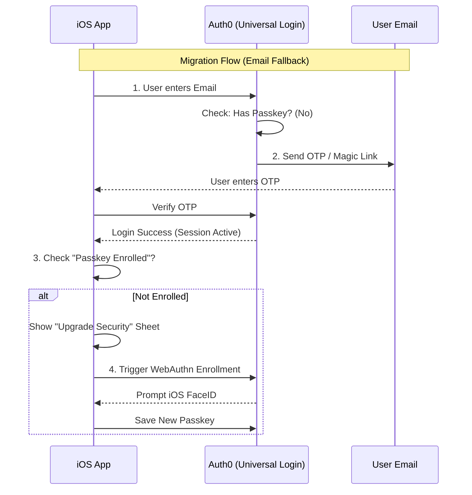

# Migration Strategy: Passage (1Password) → Auth0

## Overview
**Objective:** Migrate from Passage to Auth0.
**Advantage:** Auth0 has a feature called "Automatic Migration" (Lazy Migration) which usually helps migrate passwords.
**Problem:** Passage users *do not have passwords*. They have Passkeys.
**Constraint:** Just like with Cognito, **Passkeys cannot be migrated**. They must be re-registered.

---

## Strategy: "The Universal Login Intercept"

Auth0 allows you to inject a custom script (Action) during login. We can use this to seamlessly migrate the user's *identity* and prompt for a re-enrollment.

### Phase 1: Custom Database Setup
1.  **Identity Import:** Export emails from Passage. Import them into Auth0 as "verified emails" but with no password (or a placeholder).
2.  **Lazy Migration Script:** Configure Auth0's "Custom Database" script to call the Passage API.
    *   *Challenge:* This typically works for "Check Password", but Passage doesn't have passwords. This standard Auth0 feature **won't work** directly for Passkeys.

### Phase 2: The "Magic Link" Bridge
Since we can't "Login" to Auth0 using the old Passkey (Auth0 doesn't own the private key), we must use a common fallback: **Email Magic Link / OTP**.

#### Step 1: The "Reset" (User Perspective)
*   **Action:** User opens the app after the update.
*   **Action:** App shows "Welcome to the new Login".
*   **Action:** User enters email.
*   **Logic:** App sees user is "Legacy".
*   **Action:** App requests a **One-Time Code (Email)** from Auth0 (Passwordless connection).

#### Step 2: Authentication & Upgrade
*   **Action:** User clicks link/enters code.
*   **Result:** User is now logged into Auth0 (Identity Verified via Email).
*   **Trigger:** An **Auth0 Action** (Post-Login) detects `user.app_metadata.passkey_enrolled == false`.
*   **Action:** Auth0 redirects the user (or App handles it) to "Setup Passkey" screen.

#### Step 3: Re-enrollment
*   **Action:** User taps "Create Passkey".
*   **Action:** Auth0 stores the new WebAuthn credential against the user's profile.

---

## Architecture Diagram

## Key Risks & Mitigations

| Risk | Mitigation |
| :--- | :--- |
| **User Friction** | Moving from "FaceID" to "Check Email" is a downgrade in UX for the first login. Explain clearly: "One-time verification needed." |
| **Cost** | Auth0 "Passwordless/MFA" features are often paid features (B2B/Enterprise plans). |
| **Vendor Lock-in** | You are now enrolling Passkeys into Auth0's private ecosystem. |

