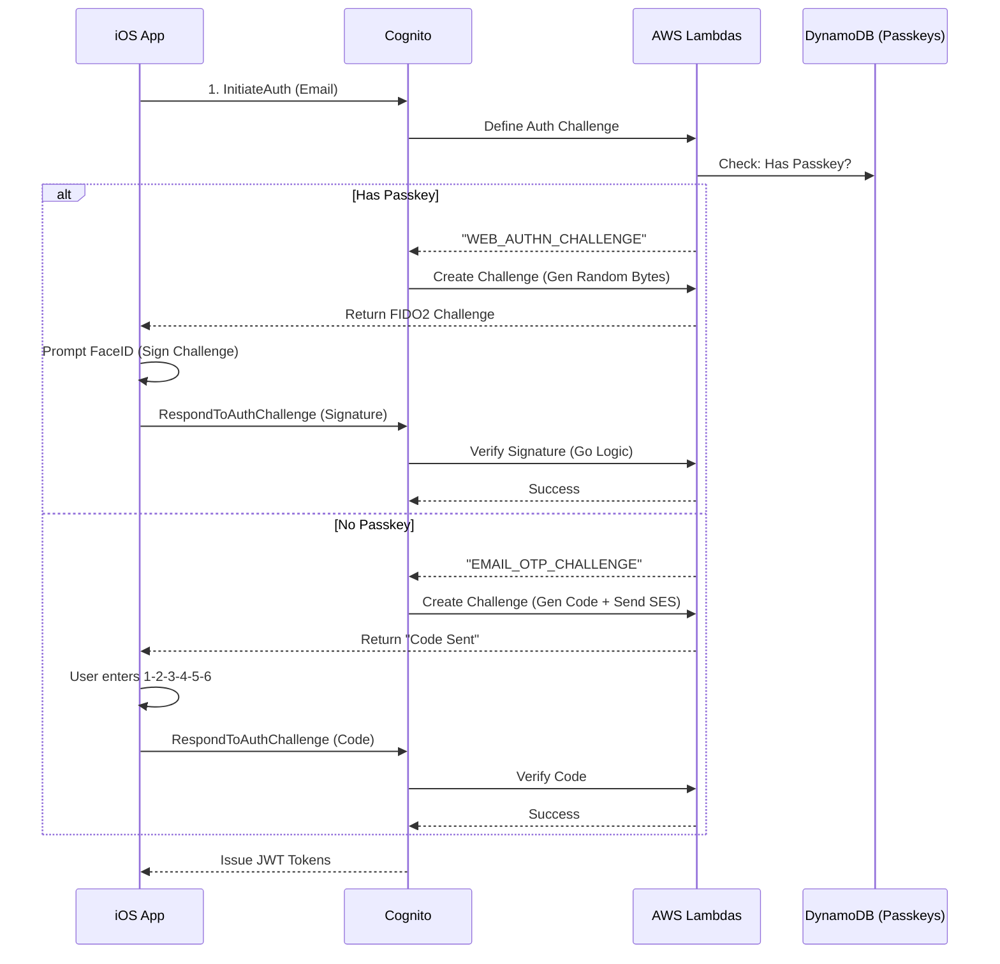

# Migration Strategy: Passage (1Password) → Pure Amazon Cognito

## Overview
**Objective:** Migrate from Passage (Passkey-first) to **only** Amazon Cognito (removing Passage completely).
**Challenge:** Cognito does **not** have a native "Passkey Rules Engine" or a built-in UI for "If Passkey -> Challenge, Else -> Email". You must build this logic yourself using **Custom Auth Challenges**.
**Trade-off:** This saves money (Cognito is free) and vendors (no Authsignal), but requires significantly more **backend coding**.

---

## Strategy: "The Lambda Orchestrator"

We will build a **Custom Authentication Flow** in Cognito using AWS Lambda triggers. This State Machine will handle the logic: *"Does this user have a Passkey? If yes, sign with WebAuthn. If no, send Email Code."*

### Phase 1: Data Migration
1.  **Export Users:** Export emails/IDs from Passage.
2.  **Import to Cognito:** Bulk import users into Cognito User Pool.
    *   Set `email_verified = true`.
    *   Set a custom attribute `custom:migration_status = "pending"`.

### Phase 2: The "Dual-Login" UI (Frontend)
During the transition, your iOS Login Screen must support two modes:

1.  **Mode A: Legacy Login (Hidden)**
    *   App checks local storage for "Passage Data".
    *   If found, it silently authenticates with Passage to get the email address.
    *   It then calls your Go API to "Force Create" the new Cognito session (using `AdminInitiateAuth` backend-to-backend).
    *   **Result:** User is seamlessly logged in to Cognito without typing anything.

2.  **Mode B: Standard Login (Cognito)**
    *   For new or migrated users, they enter their Email.
    *   Cognito triggers the "Define Auth Challenge" Lambda.

### Phase 3: The "Custom Challenge" Logic (Backend)

You must implement 3 Lambda triggers in Go (or Node.js):

#### 1. Define Auth Challenge Lambda
This is the "Brain". It decides what happens next.
*   **Logic:**
    *   If `session` is empty -> Return `CUSTOM_CHALLENGE` (Ask for Email/User).
    *   If `UserNotFound` -> Return `FAIL`.
    *   **Check DynamoDB:** Does this user have a registered Credential ID (Passkey)?
        *   **YES:** Return `CUSTOM_CHALLENGE` name: `WEB_AUTHN_CHALLENGE`.
        *   **NO:** Return `CUSTOM_CHALLENGE` name: `EMAIL_OTP_CHALLENGE`.

#### 2. Create Auth Challenge Lambda
This prepares the challenge data.
*   **If `WEB_AUTHN_CHALLENGE`:**
    *   Generate a random FIDO2 Challenge (32 bytes).
    *   Retrieve the Public Key from DynamoDB.
    *   Return `publicChallenge` to the iOS App.
*   **If `EMAIL_OTP_CHALLENGE`:**
    *   Generate a 6-digit code.
    *   Send it via SES (Amazon Simple Email Service).
    *   Return `deliveryMedium: EMAIL` to the iOS App.

#### 3. Verify Auth Challenge Response Lambda
This checks the user's answer.
*   **If `WEB_AUTHN_CHALLENGE`:**
    *   Receive the `authenticatorData` and `signature` from iOS.
    *   Verify signature against the stored Public Key (using a Go WebAuthn library).
    *   Return `isAnswerCorrect = true`.
*   **If `EMAIL_OTP_CHALLENGE`:**
    *   Compare user's input code vs stored code.
    *   Return `isAnswerCorrect = true`.

---

## Architecture Diagram

## Implementation Checklist (Pure Cognito)

1.  **DynamoDB Table:** Create a table `UserPasskeys` (Partition Key: `user_sub`, Attributes: `credential_id`, `public_key`, `sign_count`).
2.  **Lambdas:** Write the 3 triggers (Define, Create, Verify) to handle the bifurcation logic.
3.  **SES:** Verify your domain in Amazon SES to send the OTP emails.
4.  **iOS:** Update the app to handle the generic `CUSTOM_CHALLENGE` response.
    *   If `challengeName == "WEB_AUTHN_CHALLENGE"`, trigger `ASAuthorizationController`.
    *   If `challengeName == "EMAIL_OTP_CHALLENGE"`, show a text field.

## Pros & Cons vs. "Authsignal"

| Metric | Pure Cognito (Custom) | Cognito + Authsignal |
| :--- | :--- | :--- |
| **Cost** | **$0** (Free) | Free (up to 10k users) |
| **Code Effort** | **High** (You write the crypto verification) | **Low** (SDK handles it) |
| **Maintenance** | **High** (You own the FIDO2 implementation) | **Low** (SaaS managed) |
| **Security** | You are responsible for WebAuthn correctness. | Expert managed. |

**Verdict:** This is the "Hard Mode" path. It is free and fully owned by you, but you essentially have to build your own FIDO2 server inside AWS Lambda.

