```mermaid
sequenceDiagram
    autonumber
    participant User
    participant App
    participant Backend
    participant Passage
    participant Cognito
    
    Note over User,Cognito: First Login After Migration
    
    User->>App: Opens app
    App->>App: Checks: User migrated?
    App->>Backend: Check migration status
    Backend->>App: Status: Not Migrated
    
    App->>User: Show Passage Login
    User->>Passage: Authenticate (Passkey)
    Passage->>App: ✓ Success (JWT)
    
    App->>User: 🔔 "Security Upgrade Required"
    User->>App: Sets new password
    App->>Backend: Migrate user
    Backend->>Cognito: Create credentials
    Cognito->>Backend: ✓ Complete
    Backend->>App: Migration successful
    
    Note over User,Cognito: All Future Logins
    
    User->>App: Opens app
    App->>Cognito: Native login
    Cognito->>App: ✓ JWT
    App->>User: Logged in!
```

# Migration Strategy: Passage → New Authentication Provider

## 1. Executive Summary

### The Challenge

Migrating from Passage (1Password) presents a unique challenge: **Passkeys cannot be exported**. Unlike traditional password databases, the cryptographic keys used for authentication live exclusively on users' devices (iOS Secure Enclave, etc.) and are never transmitted to servers.

**This means:** You cannot simply move credentials to a new provider. Each user must establish new credentials with the new authentication system.

### Strategic Approach

We'll use a **Just-In-Time (JIT) Migration** strategy to avoid disrupting all users simultaneously. Users migrate individually when they next log in, rather than forcing a "big bang" cutover.


### Goals

1. **Zero User Lockouts** - No user should be unable to access their account
2. **Minimal Friction** - Keep re-authentication steps as simple as possible
3. **Controlled Rollout** - Gradual migration with monitoring and rollback capability
4. **Complete in 6-10 Weeks** - From start to full Passage decommission

---

## 2. Strategy A: Cognito Migration (Bridge Approach)

### Overview

This strategy maintains **both authentication systems** during a transition period. Users continue to authenticate with Passage initially, then are guided through setting up Cognito credentials for future use.

#### High-Level Architecture


### User Experience Flow



### Migration Phases

#### Phase 1: Setup (Week 1)

**Objective:** Prepare infrastructure without disrupting existing users


**Key Activities:**
- Create AWS Cognito User Pool with appropriate settings
- Export user list from Passage (emails, IDs, metadata)
- Pre-create user accounts in Cognito (no credentials yet)
- Update backend to accept JWTs from both providers
- Add custom user attribute: `migration_status: pending`

**Outcome:** Infrastructure ready, but no user-facing changes yet

---

#### Phase 2: App Updates (Week 2)

**Objective:** Deploy new app version with migration logic


**Key Activities:**
- Update iOS app with migration coordinator logic
- Build "Security Upgrade" screen
- Implement migration status tracking
- Test thoroughly in staging
- Submit to App Store for review

**Outcome:** App ready to handle migration, pending App Store approval

---

#### Phase 3: Gradual Rollout (Weeks 3-5)

**Objective:** Migrate users in controlled waves


**Migration Tracking:**


**Key Activities:**
- Enable migration for beta testers first
- Monitor metrics: login success rate, support tickets, errors
- Gradually increase percentage via feature flag
- Send email notifications to remaining users
- Provide support documentation

**Success Criteria:**
- Login success rate >95%
- Support ticket increase <15%
- Zero critical security incidents

---

#### Phase 4: Cleanup (Weeks 6-8)

**Objective:** Complete migration and decommission Passage


**Key Activities:**
- Email campaigns to users who haven't migrated
- In-app notifications with migration deadline
- Manual migration assistance for problem accounts
- Remove Passage SDK from codebase
- Cancel Passage subscription
- Archive Passage data for compliance

**Outcome:** 100% migration complete, Passage fully decommissioned

---

### Pros & Cons

#### ✅ Advantages
- **Native Experience**: Users stay within the app, no browser redirects
- **Cost Effective**: $0/month for Cognito (up to 50k MAU)
- **Full Control**: Own the entire authentication flow and UI
- **AWS Integration**: Works seamlessly if already using AWS infrastructure

#### ❌ Challenges
- **Development Time**: 6-8 weeks total implementation
- **Complexity**: Managing two authentication systems simultaneously
- **User Friction**: Explicit "set password" step may cause confusion
- **Testing Burden**: More scenarios to test and validate

---

## 3. Strategy B: Auth0 Migration (Passwordless Transition)

### Overview

This strategy **changes the authentication method** from Passkeys to Passwordless Email (Magic Links/OTP). Users don't explicitly "migrate" - they simply use email codes instead of passkeys.

#### High-Level Architecture


**Key Insight:** By switching to passwordless email, we sidestep the credential migration problem entirely. Users receive an email code - no need to "set up" anything.

### User Experience Flow


**User Perspective:** The login method changed (email code vs passkey), but there's no explicit "migration" step.

### Migration Phases

#### Phase 1: Setup (Week 1)

**Objective:** Configure Auth0 and import users


**Key Activities:**
- Create Auth0 tenant and application
- Enable passwordless email connection
- Customize email templates with branding
- Export users from Passage
- Import users to Auth0 (mark as `email_verified: true`)
- Update backend to validate Auth0 JWTs
- Test in staging environment

**Outcome:** Auth0 ready, all users imported and can log in via email

---

#### Phase 2: App Migration (Week 2)

**Objective:** Replace Passage SDK with Auth0

```mermaid
flowchart TD
    A[User Opens App] --> B[Show Email Entry]
    B --> C[User Enters Email]
    C --> D[Auth0 Sends Code]
    
    D --> E{User Chooses}
    E -->|Magic Link| F[Click Link in Email]
    E -->|Manual Code| G[Enter 6-Digit Code]
    
    F --> H[Deep Link Opens App]
    G --> H
    H --> I[Auth0 Validates]
    I --> J[User Logged In ✓]
    
    style B fill:#9cf,stroke:#333
    style J fill:#9f9,stroke:#333
```



**Key Activities:**
- Remove Passage SDK from iOS app
- Integrate Auth0 SDK
- Build passwordless email UI
- Configure deep links for magic links
- Test both OTP and magic link flows
- Submit to App Store

**Outcome:** New app version ready for release

---

#### Phase 3: Launch (Week 3)

**Objective:** Release and monitor


**Communication Plan:**


**Key Activities:**
- Send announcement email 24 hours before
- Deploy backend and release app
- Monitor metrics in real-time
- Respond quickly to support tickets
- Send follow-up communication

**Success Criteria:**
- Email delivery rate >98%
- Code entry success rate >95%
- Support ticket increase <10%

---

#### Phase 4: Enhancement (Week 4+)

**Objective:** Optionally add back passkey support


**Optional Activities:**
- Implement WebAuthn/Passkey enrollment flow
- Add "Enable Biometric Login" prompt
- Track enrollment rate
- Allow users to manage authentication methods

**Outcome:** Users can upgrade to biometric login if desired

---

### Pros & Cons

#### ✅ Advantages
- **Fast Implementation**: 3-4 weeks total
- **Zero User Friction**: No explicit "migration" step
- **Managed Service**: Auth0 handles security, rate limiting, email delivery
- **Easy Rollback**: Keep Passage active as backup during launch

#### ❌ Challenges
- **Monthly Cost**: $500-800/month for 10k MAU
- **Web Modal UX**: Initial login uses browser popup (not fully native)
- **Email Dependency**: Users must have email access
- **Perceived Security Change**: Some users may view email codes as "less secure" than passkeys

---

## 4. Comparison & Decision Framework

### Side-by-Side Comparison

| Factor | Cognito Strategy | Auth0 Strategy |
|--------|------------------|----------------|
| **Timeline** | 6-8 weeks | 3-4 weeks |
| **Development Effort** | High | Low |
| **User Friction** | Medium (explicit migration) | Low (seamless) |
| **iOS UX** | Native | Web modal |
| **Monthly Cost** | $0 | $500-800 |
| **5-Year Cost** | ~$15k (dev time) | ~$35k (recurring fees) |
| **Complexity** | High | Low |
| **Rollback** | Moderate | Easy |
| **Vendor Lock-in** | Low | Medium |

### Visual Comparison: Timeline


**Timeline Summary:**
- **Cognito:** 49 days (7 weeks)
- **Auth0:** 28 days (4 weeks)
- **Difference:** Auth0 is 43% faster

### Decision Framework

```mermaid
flowchart TD
    Start{What's most<br/>important?}
    
    Start -->|Cost| Q1{Budget?}
    Q1 -->|Tight| Cognito[✅ Choose Cognito]
    Q1 -->|Flexible| Auth0[✅ Choose Auth0]
    
    Start -->|Speed| Auth0
    
    Start -->|UX| Q2{Priority?}
    Q2 -->|Native Feel| Cognito
    Q2 -->|Zero Friction| Auth0
    
    Start -->|Team| Q3{Team Size?}
    Q3 -->|Small<br/><3 engineers| Auth0
    Q3 -->|Large<br/>3+ engineers| Cognito
    
    style Cognito fill:#9f9,stroke:#333,stroke-width:3px
    style Auth0 fill:#69f,stroke:#333,stroke-width:3px
```



### Use Case Recommendations

#### Choose **Cognito** if:


**Typical Profile:**
- Early-stage startup with AWS credits
- B2C app with premium positioning
- Engineering team with 5+ developers
- Timeline: 2-3 months acceptable
- Budget: <$10k/year for auth

---

#### Choose **Auth0** if:


**Typical Profile:**
- Small startup or solo founder
- Launching within 1-2 months
- Limited engineering resources
- Budget: $5-10k/year acceptable
- Want to focus on core product features

---

## 5. Risk Analysis & Mitigation

### Risk Matrix


### Key Risks & Mitigation

| Risk | Impact | Probability | Mitigation Strategy |
|------|--------|-------------|-------------------|
| **User Lockouts** | 🔴 High | Medium | Keep Passage active 60 days as fallback; Support team trained |
| **Email Delivery Failures** | 🟡 Medium | Medium | Use Auth0's managed delivery (Auth0 strategy); Configure SPF/DKIM properly |
| **Support Ticket Spike** | 🟡 Medium | High | Prepare FAQ, in-app tooltips, video tutorials; Add support staff during launch |
| **Data Export Errors** | 🔴 High | Low | Triple-check export/import; Validate in staging; Keep backups |
| **App Store Rejection** | 🟡 Medium | Low | Review privacy policy changes; Update app privacy labels; Pre-submission review |
| **Incomplete Migration** | 🟡 Medium | Medium | Email campaigns; In-app reminders; Grace period of 8 weeks |

### Rollback Plan

```mermaid
flowchart TD
    A[Issue Detected] --> B{Severity?}
    
    B -->|Critical<br/>>10% failure| C[IMMEDIATE ROLLBACK]
    B -->|Moderate<br/>5-10% failure| D[Pause & Fix]
    B -->|Minor<br/><5% failure| E[Monitor & Continue]
    
    C --> F[Revert Backend]
    C --> G[Force App Update]
    C --> H[Re-enable Passage]
    
    F --> I[Verify System Restored]
    G --> I
    H --> I
    
    I --> J[Post-Mortem]
    J --> K[Plan Fix]
    K --> L[Re-attempt Migration]
    
    D --> M[Hot Fix]
    M --> N[Test in Staging]
    N --> O[Resume Rollout]
    
    style C fill:#f99,stroke:#333,stroke-width:3px
    style I fill:#9f9,stroke:#333
```

**Rollback Triggers:**
- Login failure rate >10%
- Critical security vulnerability discovered
- App Store removal/suspension
- Major Auth0/AWS outage

**Rollback Time:** Target <2 hours to restore service

---

## 6. Success Metrics

### Key Performance Indicators

```mermaid
graph LR
    subgraph "Migration Health"
        A[Migration<br/>Completion Rate]
        B[Login<br/>Success Rate]
        C[Support<br/>Ticket Volume]
    end
    
    subgraph "Targets"
        A --> A1[Goal: >95%<br/>by Week 6]
        B --> B1[Goal: >98%]
        C --> C1[Goal: <15%<br/>increase]
    end
    
    style A1 fill:#9f9,stroke:#333
    style B1 fill:#9f9,stroke:#333
    style C1 fill:#9f9,stroke:#333
```

### Tracking Dashboard

Monitor these metrics daily during migration:

**User Migration Progress**
```
┌─────────────────────────────────────┐
│ Migration Status (Week 4)           │
├─────────────────────────────────────┤
│ ████████████░░░░░░░░░ 65% Migrated  │
│ ░░░░░░░░░░░░░░░░░░░░░ 25% Pending   │
│ ░░░░░░░░░░░░░░░░░░░░░  5% Issues    │
│ ░░░░░░░░░░░░░░░░░░░░░  5% Inactive  │
└─────────────────────────────────────┘
```

**Login Success Rates**
```
Day 1:  98.2% ✓
Day 2:  97.8% ✓
Day 3:  98.5% ✓
Day 4:  97.1% ⚠️ (investigate)
Day 5:  98.9% ✓
```

**Support Tickets**
```
Baseline:     20/day
Week 1:       28/day (+40%) ⚠️
Week 2:       25/day (+25%)
Week 3:       22/day (+10%)
Week 4:       20/day (normalized) ✓
```

### Success Criteria

| Milestone | Target | Measured By |
|-----------|--------|-------------|
| **Week 1** | >10% migrated | User database counts |
| **Week 3** | >50% migrated | User database counts |
| **Week 6** | >95% migrated | User database counts |
| **Week 8** | 100% migrated | Passage fully disabled |
| **Ongoing** | Login success >98% | Auth logs |
| **Ongoing** | Support tickets normalized | Support system |
| **Final** | Zero Passage API calls | Monitoring dashboards |

---

## 7. Hybrid Approach (Recommended)

### The Best of Both Worlds

Instead of choosing one strategy, consider a **staged approach**:

```mermaid
timeline
    title Hybrid Migration Strategy
    section Year 1
        Months 1-2 : Quick Auth0 Migration
                   : Get users migrated fast
                   : Low friction, minimal risk
        Months 3-12 : Stable Auth0 Operation
                    : Focus on product features
                    : Collect user feedback
    section Year 2
        Months 13-18 : Gradual Cognito Migration
                     : Build native experience
                     : Migrate from Auth0 to Cognito
        Months 19+ : Long-term Cost Savings
                   : $0/month auth costs
                   : Native iOS experience
```

### Why This Works

**Phase 1: Auth0 (Fast Win)**
- Migrate from Passage to Auth0 in 3-4 weeks
- Minimal user disruption
- Buy time to plan properly
- **Cost:** ~$6,000 for first year

**Phase 2: Cognito (Strategic Move)**  
- Migrate from Auth0 to Cognito in months 13-18
- MUCH easier than Passage→Cognito (users already have passwords)
- Build native experience properly
- **Cost:** $0/month ongoing

### Cost Analysis

```mermaid
graph TD
    subgraph "Cognito-Only Strategy"
        A1[Dev Cost: $15k] --> A2[5-Year Total: $15k]
    end
    
    subgraph "Auth0-Only Strategy"
        B1[Dev Cost: $5k] --> B2[5 years × $6k/yr] --> B3[5-Year Total: $35k]
    end
    
    subgraph "Hybrid Strategy ⭐"
        C1[Auth0 Dev: $5k] --> C2[Auth0: 1 year @ $6k]
        C2 --> C3[Cognito Dev: $8k]
        C3 --> C4[Cognito: 4 years @ $0]
        C4 --> C5[5-Year Total: $19k]
    end
    
    style C5 fill:#9f9,stroke:#333,stroke-width:3px
    style A2 fill:#9f9,stroke:#333
    style B3 fill:#ff9,stroke:#333
```

**Comparison:**
- **Cognito-Only:** $15k (but highest risk/friction)
- **Hybrid:** $19k (balanced approach) ⭐ **RECOMMENDED**
- **Auth0-Only:** $35k (lowest risk, highest cost)

### Hybrid Implementation Timeline

```mermaid
gantt
    title Hybrid Strategy Timeline
    dateFormat YYYY-MM-DD
    section Phase 1: Passage to Auth0
    Setup Auth0                        :p1a, 2024-01-01, 7d
    Migrate users                      :p1b, after p1a, 7d
    Launch & stabilize                 :p1c, after p1b, 14d
    section Steady State
    Product development                :p2, after p1c, 300d
    section Phase 2: Auth0 to Cognito
    Build Cognito integration          :p3a, after p2, 30d
    Gradual migration                  :p3b, after p3a, 60d
    Decommission Auth0                 :p3c, after p3b, 14d
```

**Benefits:**
1. **Lower Risk** - Two smaller migrations vs one complex one
2. **Faster Time-to-Market** - Get off Passage quickly
3. **Cost Optimization** - Save long-term without upfront complexity
4. **Better Planning** - Learn from Auth0 migration before Cognito
5. **Flexibility** - Can stay on Auth0 if Cognito migration not needed

---

## 8. Implementation Checklist

### Pre-Migration (Week -1)

- [ ] **Executive Decision:** Choose Cognito, Auth0, or Hybrid approach
- [ ] **Team Assembly:** Assign Backend, iOS, DevOps, Support leads
- [ ] **Data Export:** Download complete Passage user database (with backup)
- [ ] **Staging Environment:** Set up with test accounts representing different user states
- [ ] **Communication Plan:** Draft user emails, in-app messages, support FAQs
- [ ] **Rollback Plan:** Document rollback procedures and assign on-call rotation
- [ ] **Monitoring:** Set up dashboards for key metrics

### Migration Execution

#### Week 1: Infrastructure
- [ ] Create new auth provider tenant/user pool
- [ ] Configure authentication flows and security settings
- [ ] Import users (validate counts match)
- [ ] Update backend for new JWT validation
- [ ] Deploy to staging and test

#### Week 2-3: Client Updates
- [ ] Update iOS app with new authentication flow
- [ ] Build migration UI (if Cognito) or replace SDK (if Auth0)
- [ ] Comprehensive testing (happy path + edge cases)
- [ ] Submit to App Store
- [ ] Prepare release notes

#### Week 4: Launch
- [ ] Send pre-launch email to all users
- [ ] Deploy backend changes
- [ ] Release iOS app update
- [ ] Monitor real-time metrics (first 24h critical)
- [ ] Rapid response team on standby

#### Week 5-7: Optimization
- [ ] Send reminder emails to non-migrated users
- [ ] Address support tickets quickly
- [ ] Analyze patterns in failed migrations
- [ ] Adjust communication based on feedback

#### Week 8: Cleanup
- [ ] Verify >98% migration complete
- [ ] Disable Passage authentication
- [ ] Remove Passage SDK from codebase
- [ ] Cancel Passage subscription
- [ ] Conduct retrospective meeting
- [ ] Document lessons learned

### Post-Migration

- [ ] Monitor for 30 days post-decommission
- [ ] Archive Passage data per compliance requirements
- [ ] Update documentation
- [ ] Send "Thank you" email to users
- [ ] Celebrate team success! 🎉

---

## 9. Recommendation

### For Most Teams: Start with Auth0

**Why:**
1. **Lower Risk** - Simple, proven approach with managed service
2. **Faster** - 3-4 weeks vs 6-8 weeks
3. **Better UX** - No user confusion or "upgrade required" prompts
4. **Easier Rollback** - Can revert quickly if issues arise
5. **Optionality** - Can migrate to Cognito later if needed

**Consider Cognito if:**
- You're already deeply invested in AWS
- Budget is extremely tight (<$5k/year for auth)
- You have strong engineering resources available (3+ engineers)
- Native UX is absolutely critical for your brand
- You're willing to accept 6-8 week timeline

### Suggested Decision Tree

```mermaid
flowchart TD
    Start[Start Migration Planning]
    
    Start --> Q1{Timeline?}
    Q1 -->|<4 weeks| Auth0
    Q1 -->|Flexible| Q2
    
    Q2{Budget for Auth?}
    Q2 -->|Yes $500/mo| Q3
    Q2 -->|No budget| Cognito
    
    Q3{Team Size?}
    Q3 -->|1-3 engineers| Auth0
    Q3 -->|4+ engineers| Q4
    
    Q4{Already on AWS?}
    Q4 -->|Yes + expertise| Cognito
    Q4 -->|No| Auth0
    
    Auth0[✅ Start with Auth0<br/>Consider Hybrid after 6mo]
    Cognito[✅ Go with Cognito<br/>Accept longer timeline]
    
    style Auth0 fill:#69f,stroke:#333,stroke-width:3px
    style Cognito fill:#9f9,stroke:#333,stroke-width:3px
```

---

## 10. Next Steps

1. **Review** this document with stakeholders
2. **Decide** on strategy (recommend: Auth0 → Cognito hybrid)
3. **Assign** project lead and team
4. **Schedule** kickoff meeting
5. **Begin** Week 1 tasks

**Questions or concerns?** Schedule a technical review meeting before proceeding.

---

**Document Version:** 2.0  
**Last Updated:** November 19, 2024  
**Owner:** Engineering Team  
**Next Review:** Before migration kickoff
