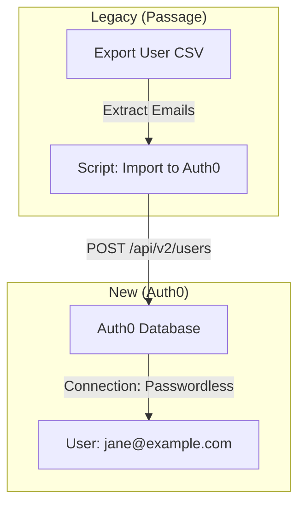
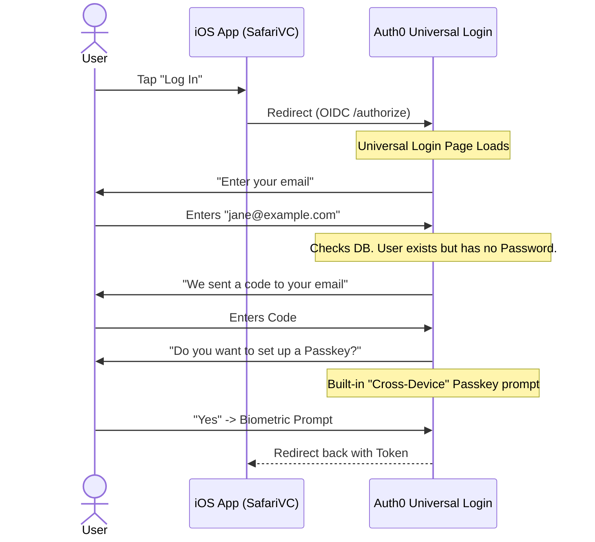

# Migration Strategy: Passage to Auth0

## 1. Executive Summary

Migrating to Auth0 is conceptually simpler because Auth0's "Universal Login" handles the fallback logic automatically, but it comes at the cost of a less "Native" feel (Web Redirects).

*   **Primary Goal:** Quickest path to stability.
*   **Trade-off:** Users will see a web-based login screen instead of a native app feel.
*   **Mechanism:** Bulk Import via Management API + Automatic Fallback.

---

## 2. Migration Architecture

### Phase 1: The "Shadow" Import
Auth0 allows you to create users via API without a password.



### Phase 2: The "Universal Login" Flow
Auth0's hosted page detects that the user has no credentials and automatically triggers the Email OTP flow.



---

## 3. Step-by-Step Implementation Plan

### Step 1: Data Export
Same as Cognito strategy: Export Emails and User IDs from Passage.

### Step 2: Bulk Import (Management API)
Use the `auth0` CLI or a script to import users.
```json
{
  "email": "jane@example.com",
  "email_verified": true,
  "connection": "email" // Important: Use Passwordless connection
}
```

### Step 3: Configure Auth0 Passwordless
1.  Enable **Passwordless** (Email Code) connection.
2.  Enable **WebAuthn Roaming Authenticators** (Passkeys) in Database settings.
3.  Customize the **Universal Login** HTML to match your branding.

### Step 4: iOS App Update
1.  Replace Passage SDK with `Auth0.swift`.
2.  Update `Info.plist` for the Callback URL (`com.myapp://...`).
3.  Remove the old "Associated Domains" for Passage.

---

## 4. Risks and Mitigations

| Risk | Impact | Mitigation |
| :--- | :--- | :--- |
| **Webview UX** | Users feel they left the app. | Customize the Universal Login UI heavily to look exactly like your app. |
| **Passkey Confusion** | iOS might suggest old keys. | Ensure the new Auth0 tenant uses a different domain (e.g., `login.auth0.com` or custom `auth.roccofridge.com`). |
| **Cost** | Auth0 B2C pricing. | Monitor MAU count carefully; delete inactive imported users if they don't login after 6 months. |

