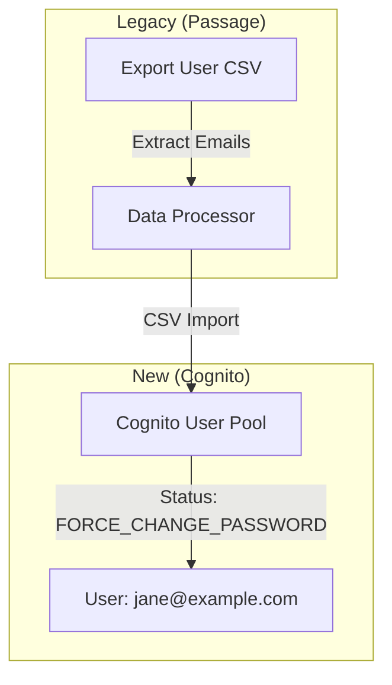
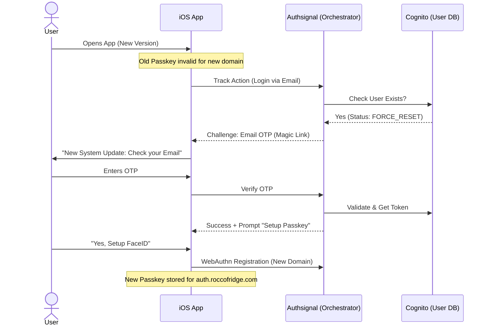

# Migration Strategy: Passage to Amazon Cognito

## 1. Executive Summary

Migrating from a Passkey-first provider like Passage to Amazon Cognito presents a unique challenge: **Passkeys cannot be exported.** They are cryptographically bound to the specific domain (RP ID) and cannot be moved.

This strategy prioritizes **User Continuity**. We cannot migrate the credentials (passkeys), but we can migrate the **Identities** (Users) and use a "Just-in-Time" (JIT) upgrade flow to re-register credentials.

*   **Primary Goal:** Zero-downtime migration for account access.
*   **Secondary Goal:** Re-establish Passkeys for high-security UX.
*   **Mechanism:** Bulk Email Import + Lazy Migration.

---

## 2. Migration Architecture

### Phase 1: The "Parallel" State
During this phase, you bulk import users into Cognito so their "Identity" exists, but they have no credentials.

### Phase 2: The "Lazy Migration" Flow (Login Experience)
Since users cannot use their old passkeys (bound to `login.roccofridge.com`), the first login attempt on the new version (bound to `auth.roccofridge.com`) will fail validation if you tried to use the old keys. Instead, we steer them through a one-time "Repair" flow.

---

## 3. Step-by-Step Implementation Plan

### Step 1: Data Export & Cleaning
1.  Export your user list from the Passage Dashboard.
2.  Filter for valid email addresses.
3.  Format a CSV for Cognito Import:
    *   Headers: `name`, `email`, `email_verified`, `phone_number_verified`
    *   Set `email_verified` to `true` (assuming you trust Passage).

### Step 2: Bulk Import to Cognito
1.  Go to **Cognito Console** -> **User Pool** -> **Users** -> **Import users**.
2.  Upload your CSV.
3.  This creates "Shadow Accounts" for all users. They exist, but have no password and no passkey.

### Step 3: Configure Authsignal (The Glue)
1.  Set up Authsignal with **Cognito** as the OIDC Provider.
2.  Enable **Email Magic Link / OTP** in Authsignal.
3.  Enable **Passkeys (WebAuthn)** in Authsignal.
4.  Create a Rule:
    *   *IF* user has no registered Passkey → Challenge Email OTP.
    *   *IF* user has registered Passkey → Challenge Passkey.

### Step 4: iOS App Update
1.  Update the `Info.plist` associated domains to include the new Authsignal domain (e.g., `auth.roccofridge.com`).
2.  Implement the `Authsignal` iOS SDK.
3.  Release the app update.

---

## 4. User Communication Plan

Since users *must* take action (checking email) for their first login, proactive communication is key.

*   **Email Blast (T-2 Days):** "We are upgrading our security system. You may be asked to verify your email on your next login."
*   **In-App Message (Old Version):** "Update available. Please update to ensure uninterrupted access."

