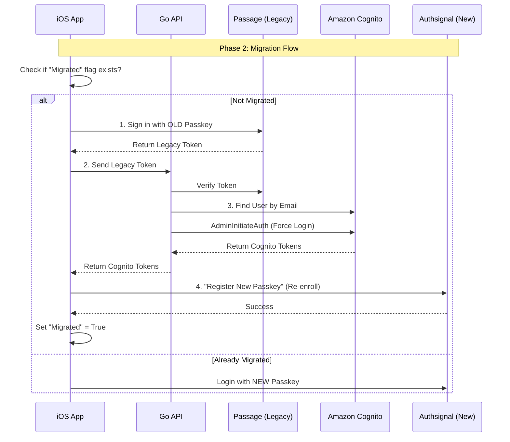

# Migration Strategy: Passage (1Password) → Amazon Cognito

## Overview
**Objective:** Migrate from Passage (Passkey-first) to Amazon Cognito while minimizing user friction.
**Core Challenge:** Passage holds the FIDO2 (Passkey) credentials. These are bound to the domain (`login.roccofridge.com`) and **cannot be exported** to Cognito.
**Impact:** **100% of Passkey users must re-register their passkey.** There is no "backend migration" for passkeys.

---

## Strategy: "The Dual-Auth Bridge"

Since we cannot move the credentials, we must move the *identity* first, then re-establish the credentials.

### Phase 1: Identity Export & Sync
1.  **Export Users:** Export all users (Email, UserID) from Passage.
2.  **Import to Cognito:** Bulk import these users into a Cognito User Pool.
    *   *Note:* Since Passage is passwordless, there are no password hashes to migrate. You will create these users in Cognito with a status of `FORCE_CHANGE_PASSWORD` or simply as "External Provider" users if using Authsignal.

### Phase 2: The "Re-Keying" UX Flow
We need a transition period where the app supports *both* Passage (to prove who they are) and Cognito (to set up the new account).

#### Step 1: Login with Legacy (Passage)
User opens the app. We detect they are a "Legacy User" (stored in local `UserDefaults` or via API check).
*   **Action:** App presents the old Passage login screen.
*   **User:** Uses their existing FaceID/TouchID.
*   **Result:** App gets a valid `Passage_Token`.

#### Step 2: Exchange Token (Backend)
Your Go API receives the `Passage_Token`.
*   **Action:** API verifies the token with Passage.
*   **Action:** API looks up the corresponding user in **Amazon Cognito**.
*   **Action:** API generates a custom "One-Time Login Token" or uses Cognito's `AdminInitiateAuth` to securely log this user into Cognito for the first time.

#### Step 3: Upgrading the Credential
Now the user is logged in with a valid Cognito Session.
*   **Action:** App prompts: *"We’ve upgraded our security. Please enable FaceID again."*
*   **Action:** User taps "Enable".
*   **Action:** App uses **Authsignal SDK** (or Cognito custom flow) to register a **NEW Passkey** against the new domain.
*   **Result:** User now has a valid credential in the new system.

### Phase 3: Decommission
Once 90% of active users have "re-keyed", remove the Passage SDK from the app update.

---

## Architecture Diagram

## Key Risks & Mitigations

| Risk | Mitigation |
| :--- | :--- |
| **User Confusion** | Update messaging: "Security Upgrade" instead of "Migration". |
| **Passage Shutdown** | Ensure all "Identity Data" (Emails/IDs) is backed up before they shut down API access. |
| **Domain Change** | Users will see a system prompt "Do you want to save a passkey for [new-domain]?" This is unavoidable. |

