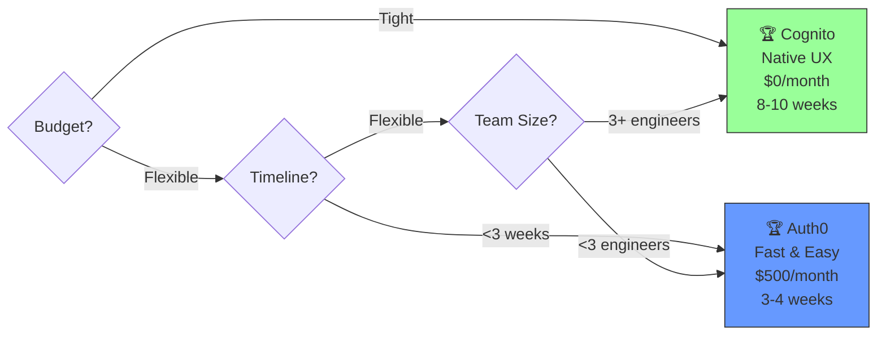
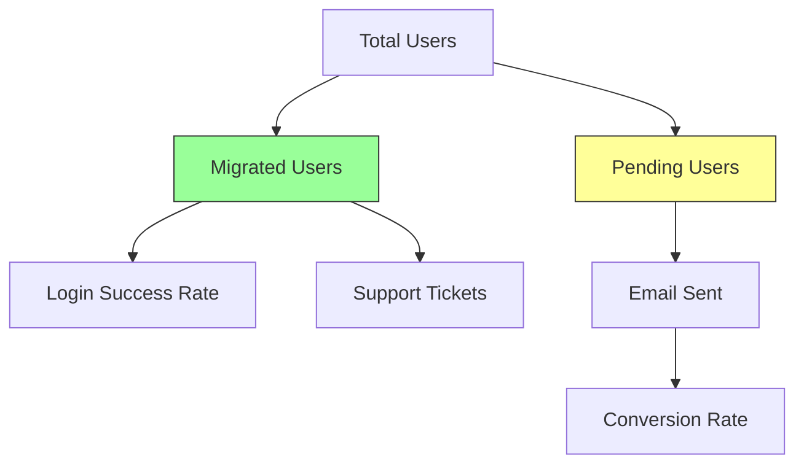

# Migration Strategy Summary: Passage → New Provider

## Quick Decision Guide



## Strategy Overview

### Strategy A: Cognito (Bridge Migration)

**Concept:** Keep Passage running while gradually migrating users

```
┌─────────────┐     ┌─────────────┐
│   Passage   │────▶│   Cognito   │
│  (Legacy)   │     │    (New)    │
└─────────────┘     └─────────────┘
       │                    │
       └────────┬───────────┘
                │
         Dual JWT Validation
                │
          ┌─────▼──────┐
          │ Go Backend │
          └────────────┘
```

**User Flow:**
1. User logs in with Passage (Passkey)
2. Immediately prompted: "Security Upgrade Required"
3. User sets new password in native UI
4. Future logins use Cognito (native)

**Pros:**
- ✅ $0/month cost
- ✅ Native iOS experience
- ✅ Full control

**Cons:**
- ❌ 8-10 weeks timeline
- ❌ High complexity
- ❌ User friction

### Strategy B: Auth0 (Passwordless Transition)

**Concept:** Switch authentication method to email-based

```
┌─────────────┐
│   Passage   │
│  (Passkey)  │
└──────┬──────┘
       │ Export
       │
       ▼
┌─────────────┐
│    Auth0    │───▶ Passwordless Email
│ (Email OTP) │     (Magic Link/Code)
└─────────────┘
       │
       └──▶ Users log in normally
            No explicit "migration"
```

**User Flow:**
1. User opens app
2. Enters email
3. Receives email code
4. Logs in (seamless!)

**Pros:**
- ✅ 3-4 weeks timeline
- ✅ Zero user friction
- ✅ Easy implementation

**Cons:**
- ❌ $500-800/month
- ❌ Web modal UX
- ❌ Email dependency

## Side-by-Side Comparison

| Factor | Cognito | Auth0 | Winner |
|--------|---------|-------|--------|
| **Speed to Production** | 8-10 weeks | 3-4 weeks | 🏆 Auth0 |
| **Monthly Cost (10k MAU)** | $0 | $500 | 🏆 Cognito |
| **5-Year Total Cost** | $15k dev | $35k total | 🏆 Cognito |
| **User Friction** | Medium | Minimal | 🏆 Auth0 |
| **iOS UX** | Native | Web Modal | 🏆 Cognito |
| **Code Complexity** | High | Low | 🏆 Auth0 |
| **Rollback Difficulty** | Medium | Easy | 🏆 Auth0 |

## Recommended Approach

### If you choose **Cognito:**

**Week 1:** Infrastructure Setup
- Create User Pool
- Export Passage users
- Bulk import to Cognito
- Implement dual JWT validation

**Weeks 2-4:** Client Implementation
- Build migration coordinator
- Implement migration UI
- Create backend endpoints
- Test thoroughly

**Weeks 5-8:** Rollout & Monitoring
- Beta test (5% users)
- Gradual rollout (50% → 100%)
- Monitor metrics
- Email campaigns

**Weeks 9-10:** Sunset
- Remove Passage SDK
- Decommission Passage

### If you choose **Auth0:**

**Week 1:** Setup
- Create Auth0 tenant
- Configure passwordless email
- Bulk import users
- Implement JWT validation

**Week 2:** Client Migration
- Replace Passage SDK with Auth0
- Implement passwordless UI
- Configure deep links
- Test flows

**Week 3:** Launch
- Deploy backend
- Release iOS app
- Monitor metrics

**Week 4:** Optimization
- Optional passkey enrollment
- Gather feedback
- Refine UX

## Hybrid Option (Best of Both)

**Year 1:** Use Auth0 for fast migration ($6k)
**Year 2+:** Migrate to Cognito for cost savings ($0)

**Benefits:**
- Speed now, savings later
- Lower risk (two smaller migrations)
- Flexibility to course-correct

**Total 5-Year Cost:** ~$6,000 (vs $15k Cognito-only or $35k Auth0-only)

## Key Metrics to Track



**Target KPIs:**
- Migration completion: >95% within 4 weeks
- Login success rate: >98%
- Support ticket increase: <10%
- User churn: <2%

## Risk Mitigation

| Risk | Likelihood | Impact | Mitigation |
|------|-----------|--------|------------|
| User lockout | Medium | High | Keep Passage active 60 days |
| Email deliverability | Low | High | Use dedicated IP, warm up |
| App Store rejection | Low | Medium | Pre-review auth changes |
| Support overwhelm | Medium | Medium | Prepare FAQs, train team |

## Next Steps

1. **Review** detailed strategy document (`migration_strategy.md`)
2. **Decide** which provider aligns with your priorities
3. **Assemble** migration team (Backend, iOS, DevOps)
4. **Schedule** kickoff meeting
5. **Execute** according to chosen timeline

---

**Questions?** Refer to the full migration document for:
- Complete code examples (Go, Swift, Python)
- Sequence diagrams for all flows
- Backend API specifications
- Rollback procedures
- Common troubleshooting guide

